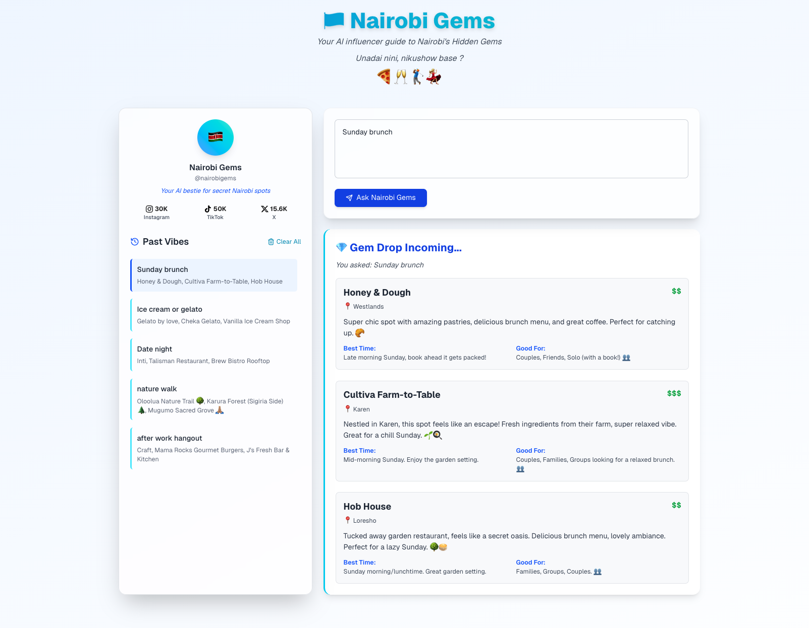

# Nairobi Gems Backend
Your AI influencer to Nairobi's Hidden Gems

A FastAPI-based Lambda service that provides AI generated Nairobi Hidden Gems recommendations based on a request from the frontend

This repo is just for the backend. It is designed to be used with a frontend application that sends requests to the `/webhook` endpoint. 

The frontend repo can be found here - https://github.com/maimbaM/llm-chat-ui

The whole application is deployed and can be found here  - https://main.d34he85m4y34lf.amplifyapp.com/




## Features

- AI-powered responses using Google's Gemini API - easily configurable to other providers like OpenAI, Azure OpenAI, Anthropic etc.
- Automated AWS Lambda deployment - using terraform and GitHub actions
- Automated testing and CI/CD pipeline

## Tech Stack

- Python 3.9
- FastAPI
- Google Gemini AI
- AWS Lambda
- Terraform
- GitHub Actions


## Setup Instructions
### Options
### Using Docker (recommended)
Ensure Docker is installed

1. Clone the repository:
```bash
git clone https://github.com/maimbaM/nairobi-gems-backend.git
cd nairobi-gems-backend
````
2. Set up environment variables:
   - Create a .env file and copy the .env.example content into it.
   - Modify the .env file with your `GEMINI_API_KEY`
   - You can also modify the `GEMINI_MODEL` as needed
   - If you want to use a different LLM provider, change the `CURRENT_LLM_ENGINE` variable to your desired provider 
     (e.g., `openai`, `azure_openai`, etc.) and set the corresponding API key and model variables. 
   - Currently supported providers are:
        - Gemini

   - Example .env file
   ```plaintext
   CURRENT_LLM_ENGINE=gemini
   GEMINI_API_KEY=your-gemini-api-key
   GEMINI_MODEL=gemini-2.5-flash-preview-04-17
   ```
3. Build the project
```bash
docker-compose up --build
```
4. Access the API at `http://localhost:8000/webhook`.
  


### Local Development

1. Clone the repository:
```bash
git clone https://github.com/maimbaM/nairobi-gems-backend.git
cd nairobi-gems-backend
```
2. Set up a virtual environment:
```bash
python -m venv .venv
source .venv/bin/activate  # On Windows: .venv\Scripts\activate
```
3. Install dependencies:
```bash
pip install -r requirements.txt
```
4. Set up environment variables:
   - Create a .env file and copy the .env.example content into it.
   - Modify the .env file with your `GEMINI_API_KEY`
   - You can also modify the `GEMINI_MODEL` as needed
   - If you want to use a different LLM provider, change the `CURRENT_LLM_ENGINE` variable to your desired provider 
     (e.g., `openai`, `azure_openai`, etc.) and set the corresponding API key and model variables. 
   - Currently supported providers are:
        - Gemini

   - Example .env file
   ```plaintext
   CURRENT_LLM_ENGINE=gemini
   GEMINI_API_KEY=your-gemini-api-key
   GEMINI_MODEL=gemini-2.5-flash-preview-04-17
   ```
5. Run the FastAPI server:
```bash
uvicorn main:app --reload
```

6. Access the API at `http://localhost:8000/webhook`.

## Testing
Run the tests using pytest with coverage:
```bash
pytest tests/ -v --cov=.

```

## Deployment
The project uses GitHub Actions for CI/CD. On push to main:  
1. Tests are run
2. Application is packaged
3. Infrastructure is created/updated via Terraform
4. Lambda function is deployed

### Secrets
You will need to set this up in your repo secrets as they will be needed by GitHub Actions.
Required secrets:  
1. AWS_ACCESS_KEY_ID
2. AWS_SECRET_ACCESS_KEY
3. S3_BUCKET
4. GEMINI_API_KEY


## API Endpoints
`POST /webhook`

Accepts questions and returns AI-generated recommendations. 

Question examples
1. Pizza places
2. Karaoke in Westlands
3. Sunday brunch spots
4. nature walks

Responses

Returns a list of 3 places to visit in Nairobi based on the question asked. Each place includes:
- `name`: Name of the place
- `location`: General area or neighborhood
- `budget`: Estimated budget (e.g., $, $$, $$$)
- `description`: A brief description of the place
- `best_time`: Best time to visit
- `good_for`: Who the place is suitable for (e.g., solo, couples, families, groups)

### Example Request


Request body:
```json
{
  "question": "nature walks"
}
```

### Example Response

Response body:
```json
{
  "places": [
    {
      "name": "Oloolua Nature Trail",
      "location": "Karen",
      "budget": "$",
      "description": "Okay, so this is *the* spot for a proper escape without leaving the city vibe too far behind. It's a lush, winding trail along a river with a cool cave and a hidden waterfall! 🤩 Perfect for getting those steps in surrounded by greenery.",
      "best_time": "Weekdays are super peaceful, but even weekends feel spacious. Mornings are fresh! ☀️",
      "good_for": "Solo walks, couples, small groups who wanna chat and stroll."
    },
    {
      "name": "Karura Forest (Limuru Road Gate)",
      "location": "Gigiri/Limuru Road",
      "budget": "$",
      "description": "Yeah, Karura's known, but try the Limuru Road side! It feels way less crowded and the trails down towards the river and waterfall from this side are magic. ✨ You can get lost (in a good way!) on different loops.",
      "best_time": "Anytime! The forest cover keeps it cool. Weekday afternoons are chill, but Sunday mornings are popular with families.",
      "good_for": "Solo runners/walkers, families, groups looking for varying trail lengths."
    },
    {
      "name": "Nairobi City Park",
      "location": "Parklands",
      "budget": "$",
      "description": "Hidden in plain sight! This park is low-key wilder than you'd expect. Old trees, monkeys chilling, and surprising quiet spots for a walk right near the CBD. It's got that slightly forgotten, charming vibe. 🐒🌳",
      "best_time": "Mid-morning on a weekday is perfect – avoids the weekend rush and the peak sun.",
      "good_for": "Solo quick breaks, spontaneous walks, anyone nearby needing a green escape."
    }
  ]
}
```

## Prompts
The prompts used for generating the recommendations are stored in the `services/llm/prompts/prompt_template.txt` file

It is stored in a separate file to allow easy modification and customization without changing the codebase.

The prompt is structured to guide the LLM in generating relevant,current, not the tourist clichés or popular spots.

It also guides on budgets, best times to visit, and suitability for different group sizes and the tone to use in responding.

Responses are returned in JSON format, this is emphasized in the prompt and also when making the request in the codebase.
```Python
response = self.client.models.generate_content(
                model=self.model,
                contents=prompt,
                config={
                    "response_mime_type": "application/json",
                    "response_schema": list[Place],
                },
            )
```


